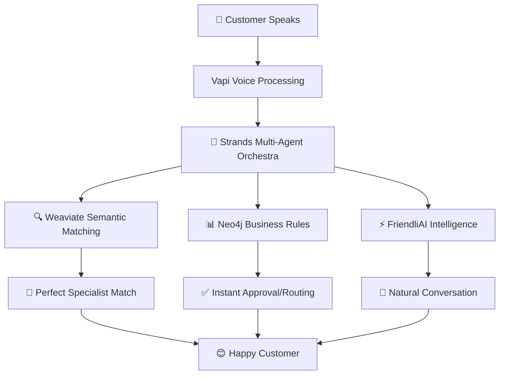

# 🎤 AIIntakeCoordinator
AI Intake Coordinator @ the AI Conference Hackathon

# 🎤 AI Voice Intake Revolution 
## The End of Contact Forms (Finally!) 
> *"Contact forms are where customers go to die. This hackathon brought them back to life with voice."* 🧟‍♂️➡️😊

Ever tried hiring an intake coordinator for a business? Yeah, good luck with that! 😅 During the hackathon, I built an AI Intake Co-ordinator Powered by Vapi, Strand Agents, Anthropic Claude, Neo4j and Weaviate. Slide deck by Gamma and code with Claude Code and Codex.

### 🏗️ The Tech Stack



### 🔧 What Each Tool Does (In Human Terms)

| Tool | What It Does | Why You Care |
|------|-------------|-------------|
| 🎤 **Vapi** | Turns speech into smart actions | No more phone tag! |
| 🧠 **Strands Agents** | Orchestrates multiple AI experts | Like having a whole team |
| 🔍 **Weaviate** | Matches "tooth pain" → endodontist | Semantic understanding magic |
| 📊 **Neo4j** | Handles complex business rules | Prevents conflicts & errors |
| ⚡ **FriendliAI** | Lightning-fast AI responses | Sub-3 second intelligence |

---

## 🎬 Live Demo Highlights

### 🦷 Dental Emergency Demo
```
🗣️ User: "I have severe tooth pain for 3 days, think I need root canal, have Delta Dental"

✅ System Response:
   👨‍⚚ Matched: Dr. Sarah Chen (Endodontist)
   💳 Insurance: 80% coverage verified
   📅 Appointment: Today 3PM available
   ⏱️ Time: 90 seconds total
```

### ⚖️ Legal Conflict Detection  
```
🗣️ User: "Car accident with MegaCorp truck, their insurance lowballing me"

⚠️ System Response:
   🚨 Conflict Detected: MegaCorp = existing client
   🔄 Auto-routed: Different qualified attorney
   📊 Case Merit: High-value claim assessed
   ⏱️ Time: 15 seconds (ethical violation prevented!)
```

### 💇 Salon Expertise Match
```
🗣️ User: "Want to go blonde but have black hair, worried about damage"

✅ System Response:
   👩‍🎨 Matched: Maya Rodriguez (Color damage specialist)
   🧪 Assessment: 4-hour safe lightening process
   💰 Price: $320-380 estimate
   ⏱️ Time: 45 seconds
```

### 📊 Tax Complexity Assessment
```
🗣️ User: "Self-employed, haven't filed in 2 years, have rental property"

🚨 System Response:
   ⚖️ Risk Level: Multi-year delinquency detected
   👨‍💼 Matched: Carlos Martinez (IRS problem resolution)
   💸 Estimate: $15K-45K potential liability
   ⏱️ Time: 2 minutes (crisis averted!)
```


